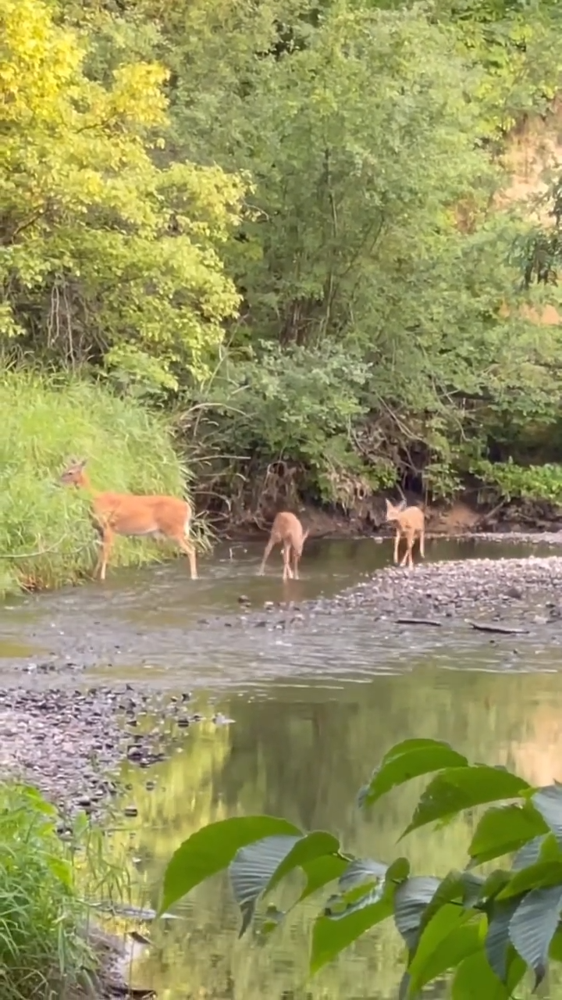
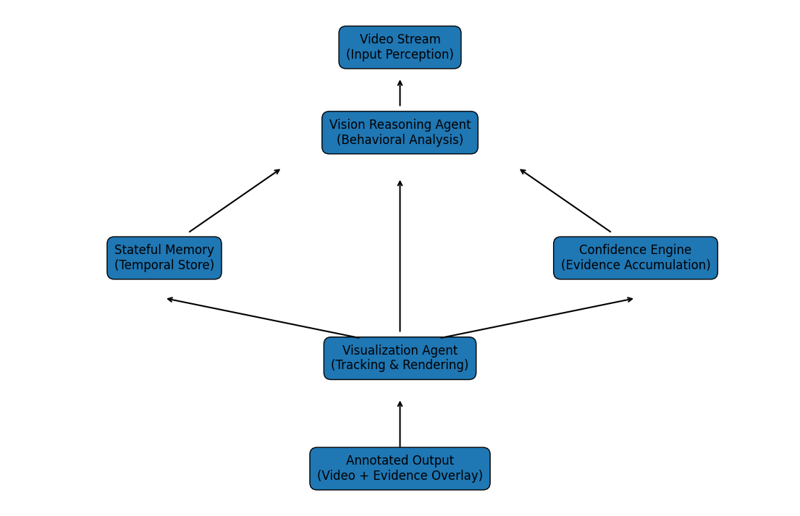

# Wildlife Behavioral Risk Vision Agent - Google Gemini 3 Hackathon

### Agentic Vision System using Google Gemini 3

An ethical, stateful, dual-agent wildlife monitoring system that detects **persistent behavioral deviations relative to group norms**, accumulates confidence over time, and visualizes at-risk animals using AI-seeded OpenCV tracking.

Built for conservation monitoring demos and the **Google Gemini 3 Hackathon**.

## Demo

<p align="center">  </p>

<p align="center">   </p>

## Problem

Wildlife conservation teams often rely on manual observation to detect:

* Injured animals
* Social exclusion
* Persistent behavioral anomalies
* Abnormal movement patterns

This process is:

* Time consuming
* Subjective
* Not scalable

We built a **stateful agentic vision system** that:

* Observes animals over time
* Learns group behavioral baselines
* Detects persistent deviations
* Escalates risk without making medical claims


## System Overview

This project contains **two cooperating AI agents**:

### 1️⃣ Behavioral Reasoning Agent (Gemini 3 Pro)

Analyzes raw wildlife video and extracts structured behavioral signals:

* Stable `individual_id`
* Relative speed (0–1)
* Posture asymmetry (0–1)
* Distance from group center
* Group baseline averages
* Confidence accumulation
* At-risk seed (time window + normalized coordinates)

It outputs structured JSON memory for downstream reasoning.


### 2️⃣ Visualization Agent (Gemini 3 Pro)

Generates a complete standalone Python script that:

* Uses memory data as a **tracking seed**
* Seeks directly to the seed timestamp
* Converts normalized coordinates → pixels
* Initializes an OpenCV CSRT tracker
* Draws red bounding boxes for at-risk animals
* Saves annotated video output
* Captures sample frames


## Workflow

```
Wildlife Video
      │
      ▼
Gemini 3 Vision Agent
(Behavioral Reasoning)
      │
      ▼
Persistent Memory (memory.json)
      │
      ▼
Gemini 3 Pro Visualization Agent
      │
      ▼
OpenCV Tracker (CSRT)
      │
      ▼
Annotated Output Video
```

## Architecture Diagram




## Key Design Principles

### Ethical by Design

* No medical diagnosis
* No claims of injury
* Only behavioral deviation signals
* Confidence accumulates over time

### Stateful Monitoring

* Observations stored persistently
* Baselines computed dynamically
* Escalation requires persistence

### Clear Agent Separation

* LLM → Semantic reasoning
* OpenCV → Geometry + tracking
* Memory → Continuity


## Behavioral Memory Example

```json
{
[
    {
    "timestamp": "00:10",
    "individual_id": "animal_3",
    "speed": 0.32,
    "posture_asymmetry": 0.67,
    "distance_from_group": 9.1,
    "group_baseline": {
        "avg_speed": 0.81,
        "avg_distance": 4.8
    },
    "explanation": {
        "seed": {
        "time_window": [10, 14],
        "avg_coordinate": [0.63, 0.58]
        }
    }
    },
    {
        "timestamp": "00:15",
        "individual_id": "animal_3",
        "speed": 0.2,
        "posture_asymmetry": 0.9,
        "distance_from_group": 2.0,
        "group_baseline": {
        "avg_speed": 0.2,
        "avg_distance": 2.0
        },
        "explanation": {
        "desc": "Slowing down, injury still visibly affecting gait.",
        "class": "Elk",
        "expected_reason": "Severe leg injury or fracture"
        }
    }
],
      "confidence": 1.0,
      "risk_level": "at_risk"
},
```


## Visualization Strategy

Instead of trusting frame-by-frame coordinates from the LLM:

1. Use reasoning output as **seed only**
2. Seek to nearest seed timestamp
3. Convert normalized coordinates to pixels
4. Initialize CSRT tracker
5. Track all subsequent frames

This ensures:

* Robustness
* Geometric consistency
* No hallucinated boxes


## How to Run

### 1️⃣ Install Dependencies

```bash
pip install -r requirements.txt
```


### 2️⃣ Set API Key

```bash
export GEMINI_API_KEY="your_api_key_here"
```


### 3️⃣ Run Behavioral Agent

```bash
python scripts/run_agent_video.py
```

This:

* Loads video
* Runs Gemini Vision reasoning
* Updates `data/memory.json`


### 4️⃣ Run Visualization Agent

```bash
python scripts/run_agent_visual.py
```

This:

* Generates executable OpenCV script
* Runs tracker
* Outputs:

```
data/output/annotated_wildlife.mp4
data/output/tracker_sample_frame/
```


## Confidence Model

Risk is escalated only when:

* Speed deviation persists
* Posture asymmetry persists
* Distance deviation persists
* Deviation exceeds group baseline
* Signal repeats across timestamps


## Technologies Used

* Google Gemini 3 Vision
* Gemini 3 Pro
* OpenCV CSRT Tracker
* Python 3.10+


## Hackathon Innovation

This project demonstrates:

* Agentic multi-model architecture
* Memory-driven video reasoning
* LLM + classical CV hybrid system
* Separation of semantic vs geometric intelligence


## Future Improvements

* YOLO integration for precise geometry
* Multi-animal concurrent tracking
* Real-time streaming inference
* Cloud deployment
* Conservation dashboard UI


## Why This Matters

This system is not just object detection.

It is:

* Behavioral understanding
* Stateful reasoning
* Ethical risk escalation
* Hybrid AI architecture

A foundation for scalable, responsible wildlife monitoring.


##  Author

[Mohamad Oghli](https://www.linkedin.com/in/mohammad-oghli/)

Senior Data Solutions Engineer

Built for [Google Gemini 3 Hackathon](https://gemini3.devpost.com/)

## Refrences

* [Google Gemini API Overview](https://ai.google.dev/gemini-api/docs)

* [Google AI Studio](https://aistudio.google.com/apps)

